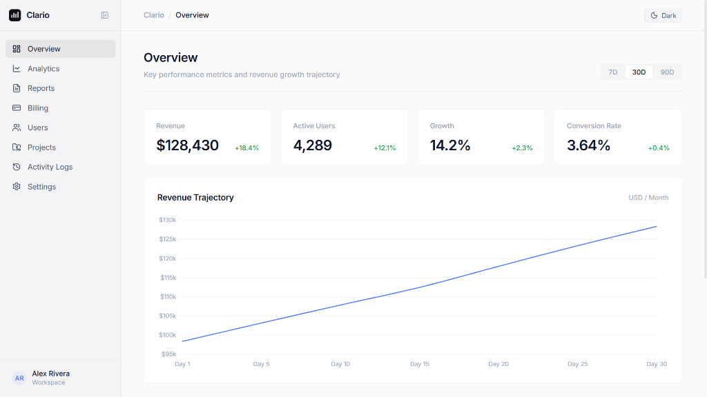

# Clario — SaaS Analytics Platform

[](https://clario-analytics-dashboard.vercel.app/) [](https://react.dev) [](https://vitejs.dev)

A minimal, production-grade SaaS analytics dashboard inspired by Stripe, Linear, and Vercel. Built with **React + Vite**, featuring a calm and structured design system with a focus on clarity over decoration.

**🔗 Live:** [https://clario-analytics-dashboard.vercel.app/](https://clario-analytics-dashboard.vercel.app/)



---

## Tech Stack

| Layer         | Technology                            |
| ------------- | ------------------------------------- |
| Framework     | React 19 + Vite 8                     |
| Animations    | GSAP (page fade-in, number counters)  |
| Smooth Scroll | Lenis                                 |
| Charts        | Chart.js + react-chartjs-2            |
| Icons         | Lucide React                          |
| Styling       | Vanilla CSS with custom design tokens |
| Fonts         | Inter + JetBrains Mono (Google Fonts) |

---

## Pages

| Page          | Route Key   | Description                                                                         |
| ------------- | ----------- | ----------------------------------------------------------------------------------- |
| Overview      | `dashboard` | 4 KPI cards, revenue trajectory line chart, recent activity feed                    |
| Analytics     | `analytics` | Single retention/growth chart with Today / Week / Month filter                      |
| Reports       | `reports`   | Scheduled exports — CSV, PDF, JSON — with download actions                          |
| Billing       | `billing`   | Stripe-inspired pricing cards (Starter, Pro, Enterprise) with monthly/annual toggle |
| Users         | `users`     | Team roster with roles, 2FA status, and member management                           |
| Projects      | `projects`  | Microservice telemetry cards — latency, uptime SLA, deployment branch               |
| Activity Logs | `activity`  | Immutable audit trail of security, billing, and deploy events                       |
| Settings      | `settings`  | Profile info, masked API key with copy, and Dark / Light theme selector             |

---

## Getting Started

```bash
# Install dependencies
npm install

# Start development server
npm run dev

# Build for production
npm run build
```

Dev server runs at **http://localhost:5173/** · Production at **[https://clario-analytics-dashboard.vercel.app/](https://clario-analytics-dashboard.vercel.app/)**

---

## Project Structure

```
src/
├── App.jsx                    # Root component, page routing
├── main.jsx                   # React entry point, context providers
├── context/
│   ├── ThemeContext.jsx        # Dark / Light theme with localStorage persistence
│   └── DashboardContext.jsx   # Global UI state (active tab, toasts, modals)
├── data/
│   └── mockData.js            # Static SaaS mock data
├── hooks/
│   ├── useLenis.js            # Lenis smooth scroll setup
│   └── useGsapAnimations.js   # GSAP page fade-in + number counter animation
├── components/
│   ├── layout/
│   │   ├── Navbar.jsx         # Top bar with breadcrumb + theme toggle
│   │   └── Sidebar.jsx        # Collapsible sidebar — 8 nav items
│   ├── ui/
│   │   └── Toast.jsx          # Non-intrusive feedback toast notifications
│   └── pages/
│       ├── DashboardPage.jsx
│       ├── AnalyticsPage.jsx
│       ├── ReportsPage.jsx
│       ├── BillingPage.jsx
│       ├── UsersPage.jsx
│       ├── ProjectsPage.jsx
│       ├── ActivityLogsPage.jsx
│       └── SettingsPage.jsx
└── styles/
    ├── tokens.css             # Color palette, radii, transitions, spacing tokens
    └── global.css             # Base reset, layout, buttons, responsive utilities
```
